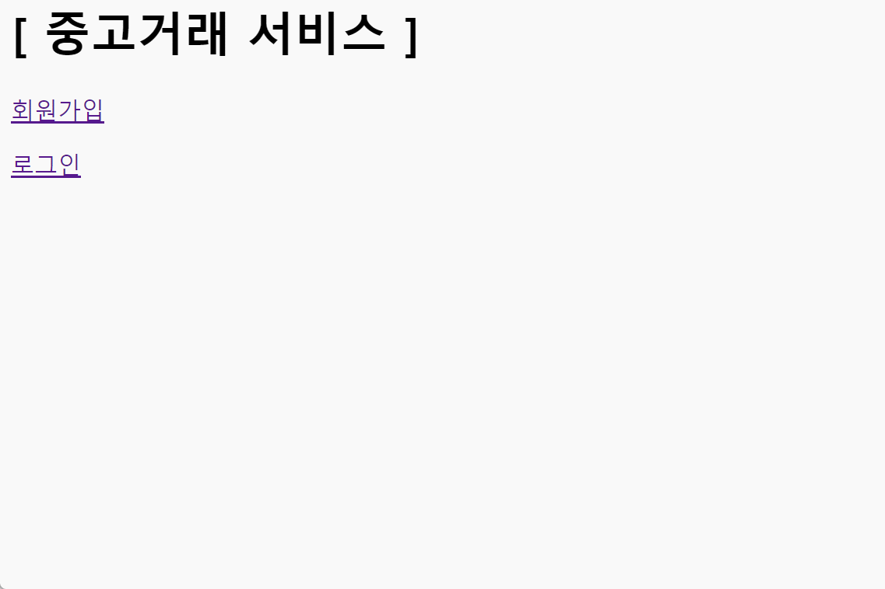

# **取引掲示板 (spring-boot-marketplace)**

このプロジェクトは、Spring Frameworkをベースにした簡単な取引掲示板のウェブアプリケーションです。会員登録、ログイン/ログアウト、投稿作成、コメント機能が含まれており、コメント機能はAJAXで非同期に処理されます。

## 実行画面 (例) 

##  ERD

## 機能

- **会員登録およびログイン/ログアウト**: Spring Securityを使用した認証および権限管理
- **投稿作成**: ログインしたユーザーは取引の投稿を作成可能
- **コメント機能**: AJAXを使用して非同期でコメントを追加および表示
- **ログインしたユーザーのみ投稿およびコメント作成が可能**

## 技術スタック

- **Back-end**: Spring Web、Spring Security、JPA、Java
- **Front-end**: Thymeleaf、jQuery、AJAX、JavaScript
- **データベース**: MySQL

---

# 거래 게시판 (spring-boot-marketplace)

이 프로젝트는 Spring Framework를 기반으로 한 간단한 거래 게시판 웹 애플리케이션입니다. 회원가입, 로그인/로그아웃, 게시글 작성 및 댓글 기능이 포함되어 있으며, 댓글 처리는 AJAX로 비동기적으로 처리됩니다.

## 기능
- **회원가입 및 로그인/로그아웃**: Spring Security를 사용한 인증 및 권한 관리
- **게시글 작성**: 로그인된 사용자는 거래 게시글을 작성할 수 있음
- **댓글 기능**: AJAX를 사용하여 비동기적으로 댓글을 추가 및 조회
- **로그인한 사용자만 게시글 및 댓글 작성 가능** 

## 기술 스택
- **Back-end**: Spring Web, Spring Security, JPA, Java
- **Front-end**: Thymeleaf, jQuery, AJAX, JavaScript
- **Database**: MySQL
